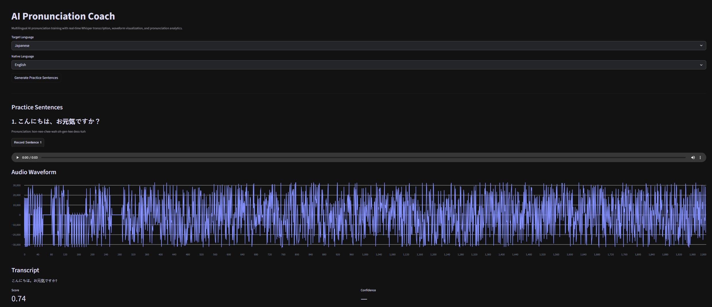
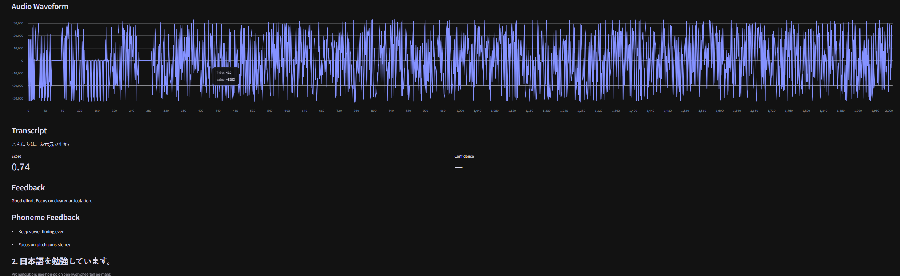
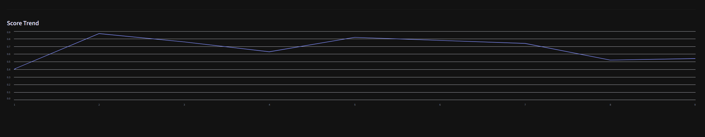

# 🎤 AI Pronunciation Coach (MLOps + GenAI)

A full-stack, production-style multilingual pronunciation coaching system built with:

- real-time microphone recording
- Whisper speech transcription
- text-similarity pronunciation scoring against target phrases
- AI-generated pronunciation feedback (OpenAI, grounded in the transcript/target/score)
- waveform visualization
- multilingual practice generation
- cloud deployment
- analytics and feature logging

The system supports:

- German
- French
- Spanish
- Portuguese
- Russian
- Japanese
- Chinese

---

## 🚀 Live Demo

### Frontend (Streamlit)

https://ai-pronunciation-mlops-4ejy6jjuq74jj6zecjtbnf.streamlit.app/

### Backend API (FastAPI)

https://ai-pronunciation-mlops.onrender.com/docs

> Recommended: use Chrome and allow microphone access for real-time recording.

---

## 🎥 Application Interface

### Main Frontend



---

### Audio Waveform Visualization



---

### Pronunciation Analytics



---

## 🧰 Tech Stack


### Frontend
- Streamlit
- streamlit-mic-recorder

### Backend
- FastAPI
- Uvicorn
- Docker
- Render

### AI / ML
- OpenAI Whisper API (transcription)
- OpenAI GPT-4o-mini (pronunciation feedback generation)
- NumPy
- SciPy
- pandas

### Analytics
- text-similarity pronunciation scoring
- feature logging
- pronunciation score trend analytics

### Features
- multilingual pronunciation coaching
- microphone recording
- waveform visualization
- transcript-aware phoneme feedback
- cloud deployment
- real-time speech transcription

---

## 🏗️ Architecture

```text
Streamlit Frontend
        ↓
FastAPI Backend
        ↓
Whisper Transcription API
        ↓
Pronunciation Analysis + Feedback
        ↓
Analytics + Feature Store
```

---

## ⚡ Quick Start (Local)

### 1. Clone repository

```bash
git clone https://github.com/geotheleo/ai-pronunciation-mlops.git
cd ai-pronunciation-mlops
```

---

### 2. Create virtual environment

#### Windows

```bash
python -m venv venv
venv\Scripts\activate
```

#### macOS / Linux

```bash
python3 -m venv venv
source venv/bin/activate
```

---

### 3. Install dependencies

```bash
pip install -r requirements.txt
```

---

### 4. Configure environment variables

Create:

```text
.env
```

Add:

```env
OPENAI_API_KEY=your_openai_api_key
API_BASE=https://ai-pronunciation-mlops.onrender.com
```

---

### 5. Run FastAPI backend

```bash
uvicorn app.main:app --reload
```

---

### 6. Run Streamlit frontend

```bash
streamlit run app_streamlit.py
```

---

## 📡 API Endpoints

### POST `/analyze`

Analyzes uploaded speech audio (with an optional `target_text` form field for guided
practice sentences) and returns:

- transcript (OpenAI Whisper)
- pronunciation score — text-similarity between the transcript and `target_text`, `null`
  when no target is given (free/open practice, where there's nothing to score against)
- phoneme-level tips (AI-generated)
- AI coaching feedback (OpenAI GPT-4o-mini, grounded in the transcript, target phrase, and score)

---

### POST `/generate-practice`

Generates multilingual practice sentences with phonetic guidance.

---

### GET `/analytics`

Returns stored pronunciation score history for analytics visualization.

---

## 📊 Evaluation & Results

The application supports:

- multilingual speech transcription
- transcript-aware pronunciation feedback
- waveform analysis
- pronunciation score tracking
- feature logging for retraining workflows

Example evaluation dimensions:

- transcription quality
- pronunciation scoring consistency
- response latency
- multilingual coverage
- phoneme feedback relevance

---

## ☁️ Deployment

### Frontend
- Streamlit Community Cloud

### Backend
- Render
- Dockerized FastAPI service

### Deployment Features
- environment-variable configuration
- CORS-enabled API
- cloud-hosted inference
- separated frontend/backend architecture

---

## 🔮 Future Improvements

- real phoneme alignment (acoustic model, beyond text-similarity)
- MLflow experiment tracking
- PostgreSQL feature store
- user authentication
- pronunciation history dashboards
- CI/CD pipelines
- automated retraining jobs
- advanced speech embeddings
- adaptive difficulty levels

---

## 📄 License

MIT License

---

## 👤 Author

GeoTheLeo - Geo Smith